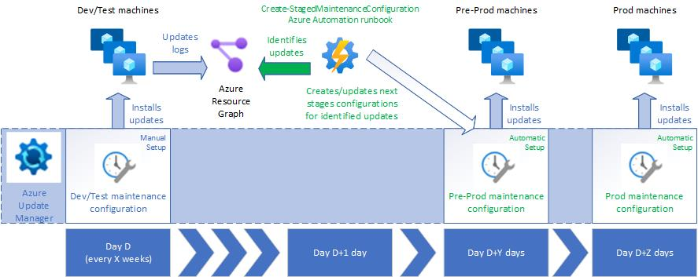

# Azure Update Manager Tools

This repository contains tools for managing [Azure Update Manager](https://learn.microsoft.com/en-us/azure/update-center/overview) scenarios.

## Staged Patching with Azure Automation

With a staged patching solution, OS updates are first deployed in a test environment and are later deployed in pre-production and production environments, ensuring the latter environments only get the very specific updates initially deployed in the test environment. With this approach, you significantly decrease the chances of having a OS update breaking a production system.

The typical setup of staging patching can be as follows:

1. Dev/Test machines of a specific OS type/version are recurrently patched (e.g., every few weeks) for all update classifications (stage 0).
1. Each Dev/Test patch cycle ends with a specific set of updates (e.g., specific Windows KB IDs or Linux package versions) that were successfully installed across all Dev/Test machines.
1. Pre-production machines are patched a few days later (stage 1) with the very specific updates that were deployed in Dev/Test (stage 0).
1. Production machines are patched one or two weeks later (stage 2) with the same updates that were deployed and tested in Dev/Test (stage 0) and Pre-Production (stage 1).

This staged patching approach can be implemented with the help of the [Create-StagedMaintenanceConfiguration.ps1](./Create-StagedMaintenanceConfiguration.ps1) PowerShell script, which runs after stage 0 and automates stages 1 and 2. This script can be, for example, deployed as an Azure Automation Runbook scheduled to run after the Dev/Test recurrent update cycle (see diagram below). It works for both Windows and Linux scenarios (Azure VMs and Azure Arc-enabled servers).



### Recommended staged patching strategy

TODO

### Pre-requisites

* The machines in the scope of this solution must have the [Customer Managed Schedules patch orchestration mode](https://learn.microsoft.com/en-us/azure/update-center/manage-update-settings).
* The machines in the scope of this solution must be [supported by Azure Update Manager](https://learn.microsoft.com/en-us/azure/update-center/support-matrix).
* At least one Maintenance Configuration covering a part of the machines in scope. As this maintenance configuration will serve as the reference for the following patching stages, it should be assigned to non-production machines and, ideally, recur every few weeks.
* An Azure Automation Account with an associated Managed Identity (can be a system or user-assigned identity) and the following modules installed: `Az.Accounts`, `Az.Resources` and `Az.ResourceGraph`. This solution is based on an Automation Account, but you can use other approaches, such as Azure Functions.
* The Automation Account Managed Identity must have the following **minimum** permissions (as a custom role) on the subscription where the reference maintenance configuration was created:
  * */read
  * Microsoft.Maintenance/maintenanceConfigurations/write
  * Microsoft.Maintenance/configurationAssignments/write
  * Microsoft.Resources/deployments/*

### Setup instructions

TODO

### Create-StagedMaintenanceConfiguration script parameters

The [Create-StagedMaintenanceConfiguration.ps1](./Create-StagedMaintenanceConfiguration.ps1) PowerShell script receives the following parameters:

- `MaintenanceConfigurationId`: ARM Id of the Maintenance Configuration to be used as a reference to create maintenance configurations for further stages
- `NextStagePropertiesJson`: JSON-formatted parameter that will define the scope of the new maintenance configurations, with the following schema:

```json
{
  "$schema": "http://json-schema.org/draft-04/schema#",
  "type": "array",
  "items": [
    {
      "type": "object",
      "properties": {
        "stageName": {
          "type": "string"
        },
        "offsetDays": {
          "type": "integer"
        },
        "scope": {
          "type": "array",
          "items": [
            {
              "type": "string"
            }
          ]
        },
        "filter": {
          "type": "object",
          "properties": {
            "resourceTypes": {
              "type": "array",
              "items": [
                {
                  "type": "string"
                }
              ]
            },
            "resourceGroups": {
              "type": "array",
              "items": [
                {
                  "type": "string"
                }
              ]
            },
            "tagSettings": {
              "type": "object",
              "properties": {
                "tags": {
                  "type": "object",
                  "properties": {
                    "tagName1": {
                      "type": "array",
                      "items": [
                        {
                          "type": "string"
                        }
                      ]
                    },
                    "tagNameN": {
                      "type": "array",
                      "items": [
                        {
                          "type": "string"
                        }
                      ]
                    }
                  }
                },
                "filterOperator": {
                  "type": "string"
                }
              },
              "required": [
                "tags",
                "filterOperator"
              ]
            },
            "locations": {
              "type": "array",
              "items": [
                {
                  "type": "string"
                }
              ]
            },
            "osTypes": {
              "type": "array",
              "items": [
                {
                  "type": "string"
                }
              ]
            }
          }
        }
      },
      "required": [
        "stageName",
        "offsetDays",
        "scope",
        "filter"
      ]
    }
  ]
}
```

The example below implements a scenario in which the Pre-Production and Production stages are deployed respectively 7 days and 14 days after the reference maintenance configuration (Dev/Test). The maintenance scope is targeted at two subscriptions (`00000000-0000-0000-0000-000000000000` and `00000000-0000-0000-0000-000000000001`), for
both Windows Azure VMs and Azure Arc-enabled servers tagged with `aum-stage=phase1|phase2` and `os-name=windows2019`. The `filter` property follows the format defined
for Maintenance Configuration Assignments ([see reference](https://learn.microsoft.com/en-us/azure/templates/microsoft.maintenance/configurationassignments?pivots=deployment-language-arm-template)).

```json
[
    {
        "stageName": "Pre-Production",
        "offsetDays": 7,
        "scope": [
            "/subscriptions/00000000-0000-0000-0000-000000000000",
            "/subscriptions/00000000-0000-0000-0000-000000000001"
        ],
        "filter": {
            "resourceTypes": [
                "microsoft.compute/virtualmachines",
                "microsoft.hybridcompute/machines"
            ],
            "resourceGroups": [
            ],
            "tagSettings": {
                "tags": {
                    "aum-stage": [
                        "phase1"
                    ],
                    "os-name": [
                        "windows2019"
                    ]
                },
                "filterOperator": "All"
            },
            "locations": [],
            "osTypes": [
                "Windows"
            ]
        }
    },
    {
        "stageName": "Production",
        "offsetDays": 14,
        "scope": [
            "/subscriptions/00000000-0000-0000-0000-000000000000",
            "/subscriptions/00000000-0000-0000-0000-000000000001"
        ],
        "filter": {
            "resourceTypes": [
                "microsoft.compute/virtualmachines",
                "microsoft.hybridcompute/machines"
            ],
            "resourceGroups": [
            ],
            "tagSettings": {
                "tags": {
                    "aum-stage": [
                        "phase2"
                    ],
                    "os-name": [
                        "windows2019"
                    ]
                },
                "filterOperator": "All"
            },
            "locations": [],
            "osTypes": [
                "Windows"
            ]
        }
    }
]
```